# Как оформалять лабораторные

Ниже приводится пожаговое описание того, как нужно будет офорлять каждую задачу в рамках лабораторных.

Напомню, что мы договорились - каждая лабораторная может состоять из нескольких задач (часть могут быть между собой связаны, часть - нет). 

## Общие моменты
- Подготовка аккаунта
    - Создайте или настройте имеющийся аккаунт на GitHub - нужно чтобы по первой страницы было понятно - чей он (фотографию не обязательно, достаточно имени и группы). Если так спокойнее - создайте аккаунт чисто под наш курс и потом удалите 
- Подготовка репозитория
    - Для каждой лабораторной на GitHub создаете отдельный **приватный** репозиторий с именем DevTools_labXX (где XX - номер работы: 01, 02, 03, ...)
    - Пригласите меня (аккаунт MihailRomanov) в качестве участника
    - Струкутра папок внутри репозитория - на ваше усмотрение, в том числе, если нужно будет передлать позже - пожалуйста
    - Если к задаче предлагается стартовый набор артефактов (например, если задача состоит в доработке какой-то библиотеки, то стартовым набором будет исходный код этой библиотеки), то этот стартовый код должен быть помещен в основную ветку репозитория (main/master), **до** начала работы над задачей
- Выполнение задачи
    - Для каждой задачи создаете отдельную ветка репозитория (ветка создается из основной)
    - Все работы по задаче - в этой ветке
- Сдача работы
  - Создаете PR в master: 
    - В PR включаются все доработки в рамках задачи
    - В заголовке PR указать название курса, номер лабораторной и задачи, автора и группу: **DevTools 01/02 (Прилукин Евгений, Ш22-191-02)**
 - Указываете меня в качестве ревьюера
 - Ожидаете результатов ревью:
   - Если ревью пройдено - мержите PR в мастер
   - Если отклонено - исправляете замечания и инициируете повторное ревью (в рамках того же PR)
 
 Дополнения:
- Если в рамках решения задачи будет нужно создать несколько веток - пожалуйста. Главное, чтобы потом вы смогли создать 1 PR на все измнения
- Количество коммитов - тоже на ваше усмотрение: хотите заливайте всё одним, хотите дробите хоть на 1000

## Пошаговый пример

Ниже будет показано, как сделать то, что кратко описано выше. Для примера возьемем первую задачу в первой лабораторной

### Подготовка аккаунта
- Создаём или настраиваем имеющийся аккаунт на GitHub
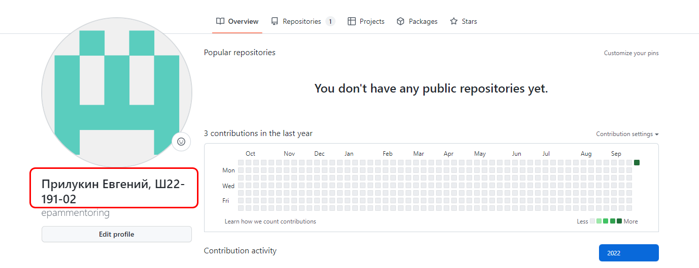

### Подготовка репозитория
- Создаем репозиторий 
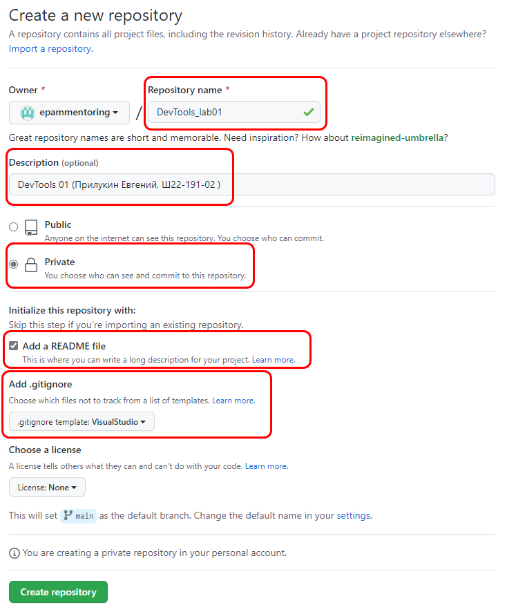

Обратите внимание на выделенные поля: можно пропустить добавление readme файла, но остальные рекомендуется заполнить

- Добавляем меня в качестве участника проекта
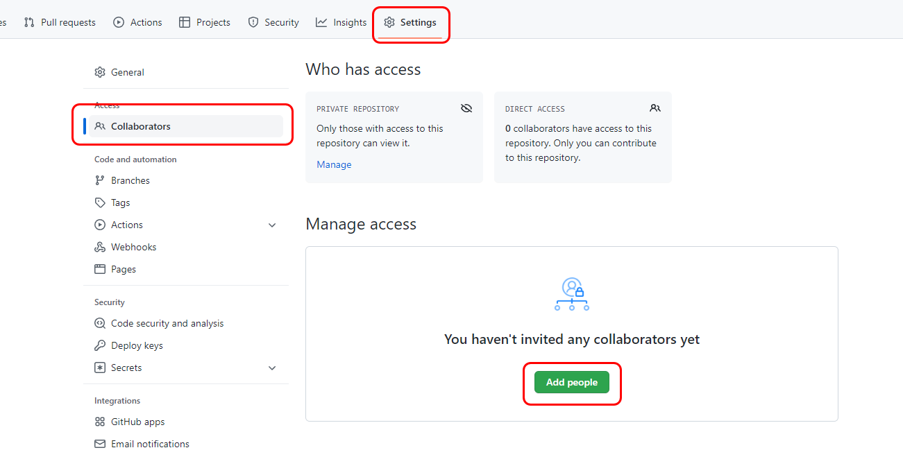
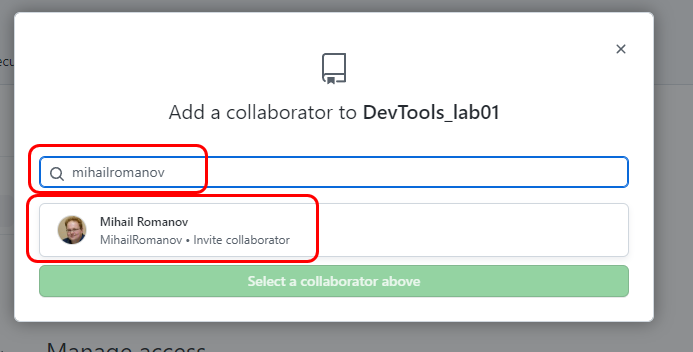
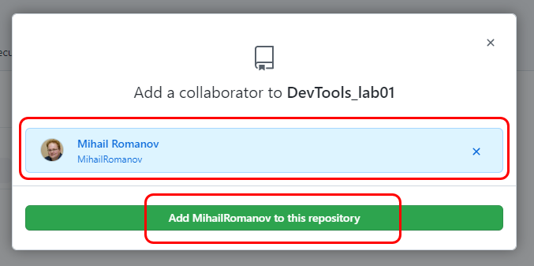

Чтобы убедиться, что я принял приглашение посмотрите в список участников. Должен смениться статус **Pending invite**
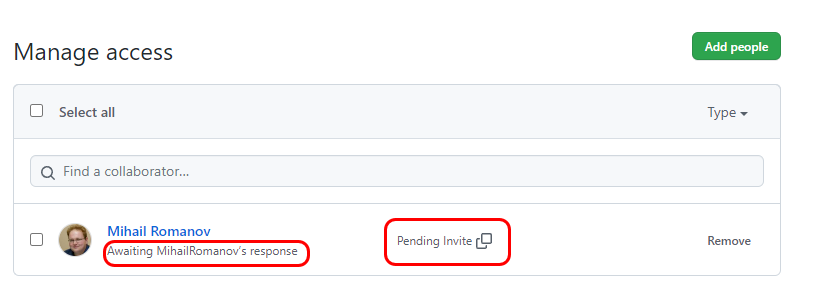
На полноценное участие
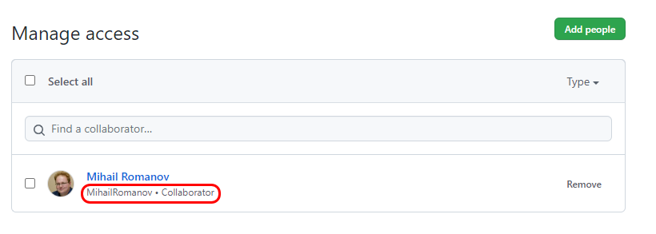

- Заносим в master (main) исходные артефакты задачи. Здесь мы не будем придумывать схему именования - просто скопируем папку PowerCollections как есть:
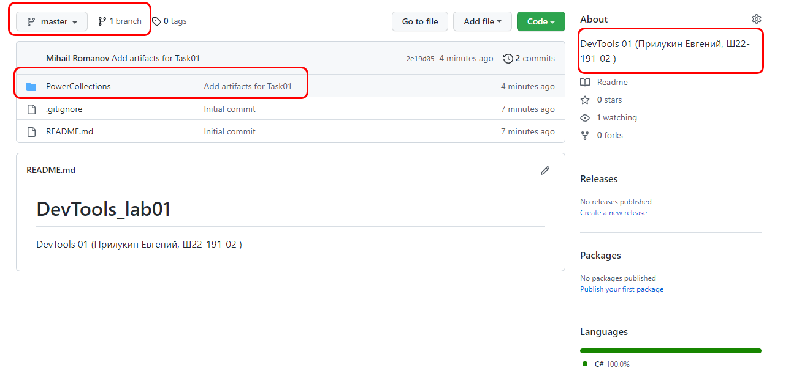

### Выполнение задачи
- Создаем отдельную ветку (можно прямо в GitHub, можно локально, а потом залить на сервер - как вам удобно). Именование - произвольное
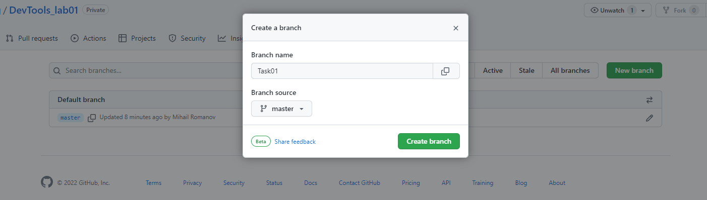

- Выполняем задачу, коммитим, заливаем
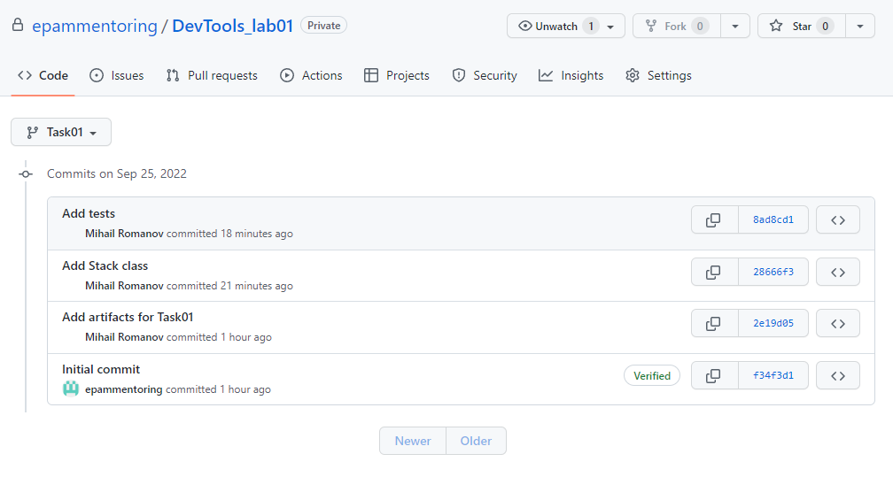

### Сдача работы
- Создаем PR
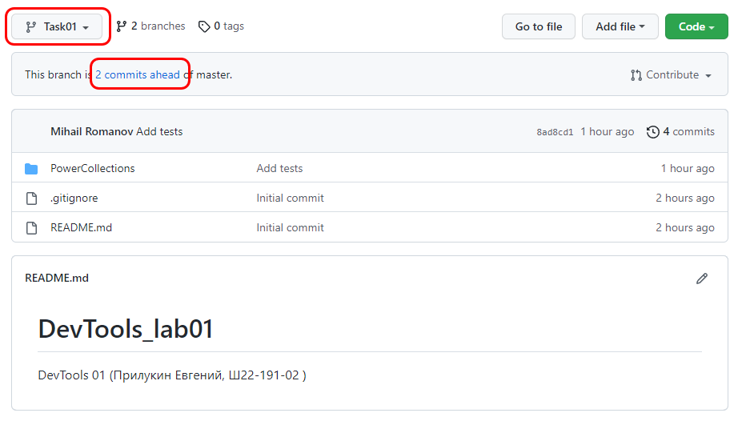
    - Убедитесь, что все коммиты включены и PR создается из нужной ветки в master
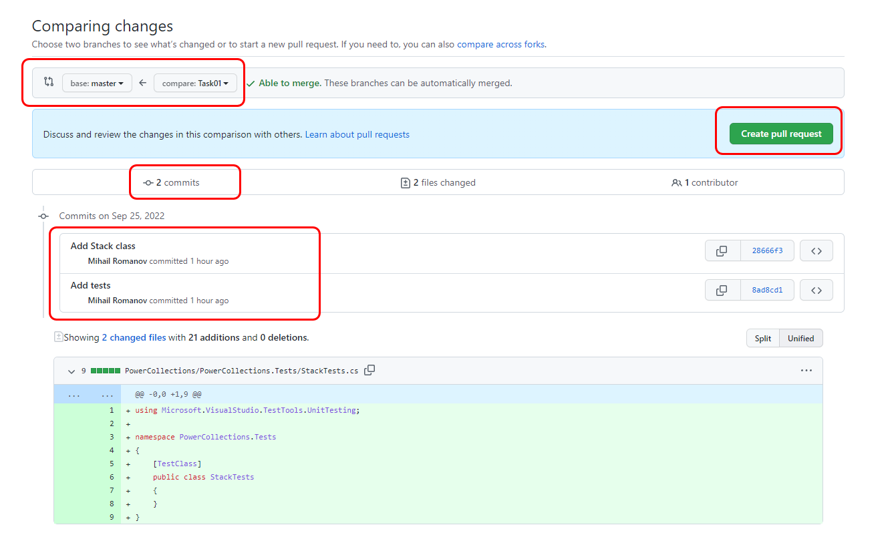
    - Заполните PR
        - название в виде **DevTools \<lab_number\>/\<task_number\> (\<autor\>, \<group\>)**
        - краткое описание: что сделано, какие особенности (если есть)
        - укажите меня в качестве Reviewer
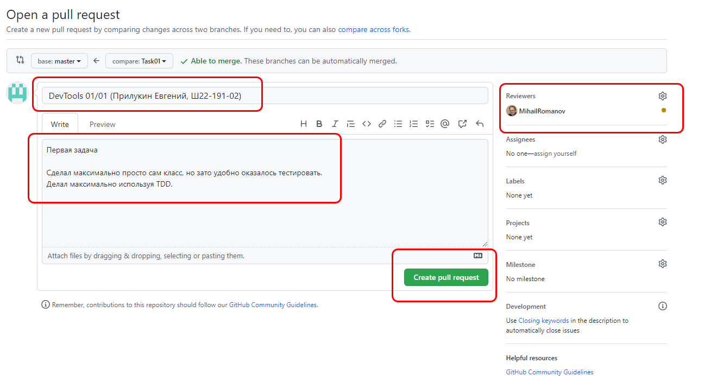

- Ждем ответа: 
    - на почту (если в настройках аккунта указана почта и настроенны оповещения)
    - или периодически проверяем закладку **Pool requests**
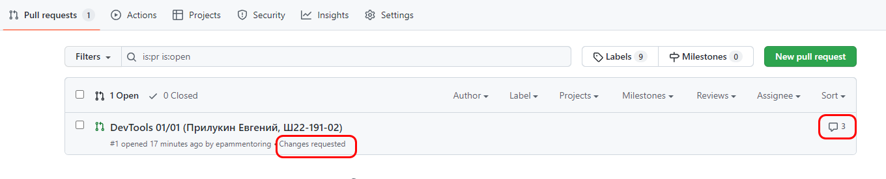

- Если статус **Changes requested**
    - Смотрим, какие замечания 
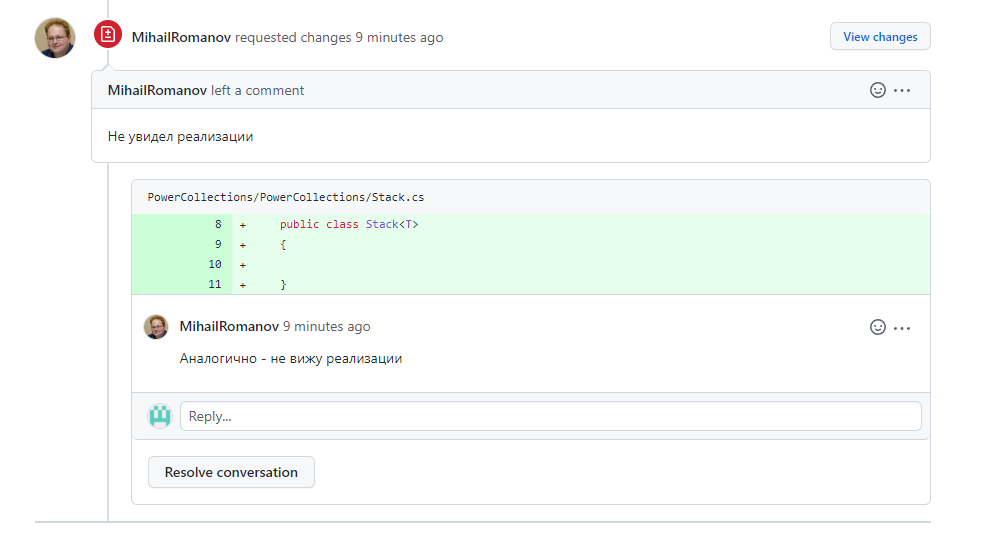
    - Исправляем
    - Пишем ответный комментарий и ставим **Resolve conversation** (смотрите где удобнее - на закладке Conversation, File Changed, ...)
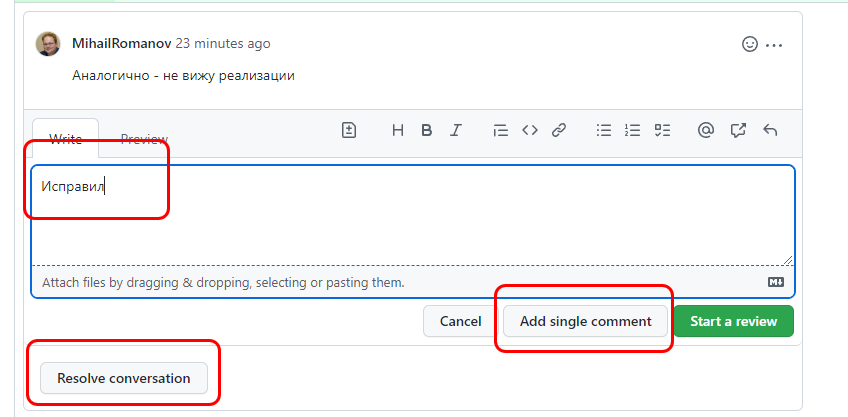

    - Возвращаемся на закладку **Conversation** и презапрашиваем ревью
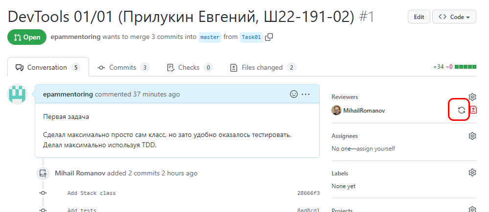

- Если статус **Approved**
    - Мержим изменения в мастер
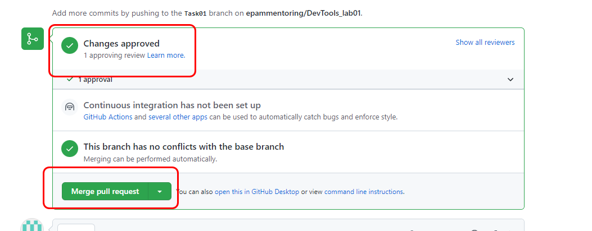